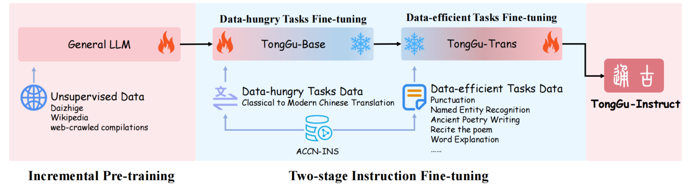
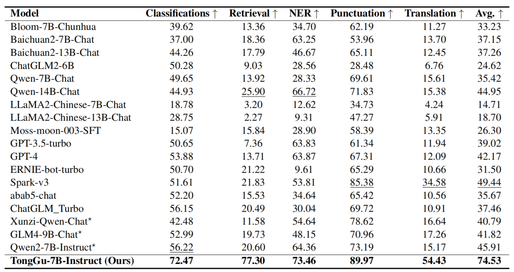
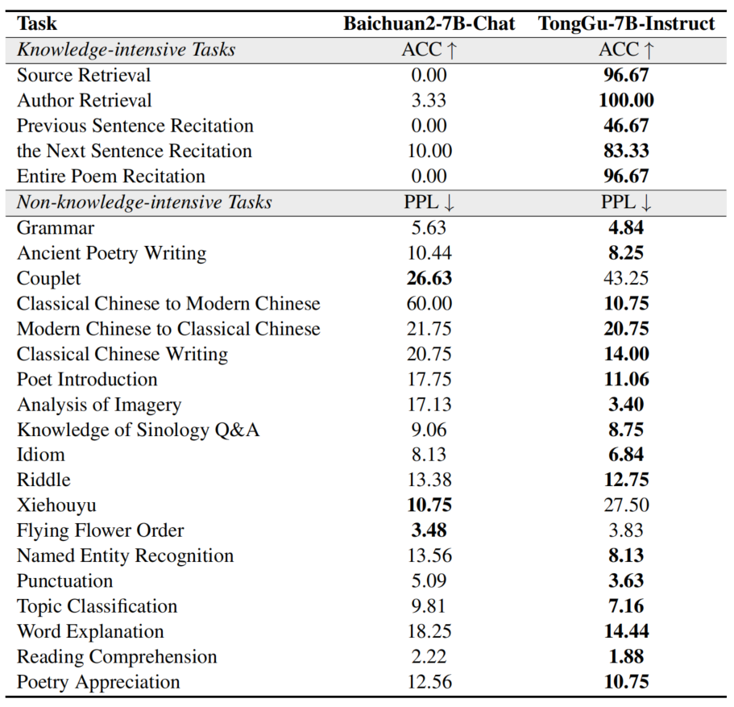

<p align="left">
    中文&nbsp ｜ &nbsp<a href="./README_en.md">English</a>
</p>
<div align="center">
  
</div>


# 通古大模型

## 介绍

通古大模型是华南理工大学深度学习与视觉计算实验室（SCUT-DLVCLab）开发的古籍大语言模型，具备较强大的古籍理解和处理能力，通古大模型使用了多阶段的指令微调，并创新性地提出了冗余度感知微调（RAT）方法，在提升下游任务性能的同时极大地保留了基座模型的能力。

<div align="center">
  
</div>


## 评测结果

通古在广泛的古籍理解和处理任务上超越了现有的模型，与其基座模型Baichuan2-7B-Chat的对比显示了通古训练流程和方法的有效性，在未来通古会持续更新模型并受益于更强大的基座模型。

<div align="center">
  
</div>

<div align="center">
  
</div>


# 开源清单

## 模型

[**TongGu-7B-Instruct**](https://huggingface.co/DLVCLab/TongGu-7B-Instruct): 7B古籍大语言模型，基于Baichuan2-7B-Base，在2.41B古籍语料上做无监督增量预训练，并在400万古籍对话数据上做指令微调，具备古文句读、翻译、赏析等功能。

| 模型名称                       | 下载链接                                                     |
| :----------------------------- | :----------------------------------------------------------- |
|TongGu-7B-Instruct    | [链接](https://huggingface.co/DLVCLab/TongGu-7B-Instruct) |

## 数据

**ACCN-INS**: 400万古籍指令微调数据，涵盖古文理解、生成、知识三个维度的共24类估计任务。

ACCN-INS数据集只能用于非商业研究目的。对于想要使用ACCN-INS数据集的学者或组织，请先填写此[申请表](./application-form/Application-Form-for-Using-ACCN-INS.docx)并通过电子邮件发送给我们。向我们提交申请表时，请列出或附上您近6年发表的论文1-2篇，以表明您（或您的团队）在古籍领域进行研究。
我们收到并批准您的申请后，将为您提供下载链接和解压密码。
所有用户必须遵守所有使用条件；否则，将撤销授权。


# 新闻

- 2024/9/21 通古论文被EMNLP2024接收。
- 2024/9/26 通古模型及指令微调数据正式开源。


# 用例

<details><summary><b>句读</b></summary>
    


</details>

<details><summary><b>成语解释</b></summary>
    


</details>

<details><summary><b>文白翻译</b></summary>
    


</details>

<details><summary><b>白文翻译</b></summary>
    


</details>

<details><summary><b>诗词创作</b></summary>
    


</details>


# 推理

```python
import torch
from transformers import AutoModelForCausalLM, AutoTokenizer

model_path = "DLVCLab/TongGu-7B-Instruct"
model = AutoModelForCausalLM.from_pretrained(model_path, device_map='auto', torch_dtype=torch.bfloat16, trust_remote_code=True)
tokenizer = AutoTokenizer.from_pretrained(model_path, trust_remote_code=True)

system_message = "你是通古，由华南理工大学DLVCLab训练而来的古文大模型。你具备丰富的古文知识，为用户提供有用、准确的回答。"
user_query = "翻译成白话文：大学之道，在明明德，在亲民，在止于至善。"
prompt = f"{system_message}\n<用户> {user_query}\n<通古> "
inputs = tokenizer(prompt, return_tensors='pt')
generate_ids = model.generate(
    inputs.input_ids.cuda(), 
    max_new_tokens=128
)
generate_text = tokenizer.batch_decode(
    generate_ids, 
    skip_special_tokens=True,
    clean_up_tokenization_spaces=False
)[0][len(prompt):]

print(generate_text)
```


# 引用

```
@article{cao2024tonggu,
  title={TongGu: Mastering Classical Chinese Understanding with Knowledge-Grounded Large Language Models},
  author={Cao, Jiahuan and Peng, Dezhi and Zhang, Peirong and Shi, Yongxin and Liu, Yang and Ding, Kai and Jin, Lianwen},
  journal={EMNLP 2024},
  year={2024}
}
```

# 声明

经过大规模数据的增量预训练和指令微调，通古具备较强的古籍处理能力，如句读、翻译等，然而受限于模型规模、自回归生成范式等，通古仍然可能生成包含事实性错误的误导性回复或包含偏见/歧视的有害内容，请谨慎使用和注意甄别，请勿将通古生成的有害内容传播至互联网。若产生不良后果，由传播者自负。
